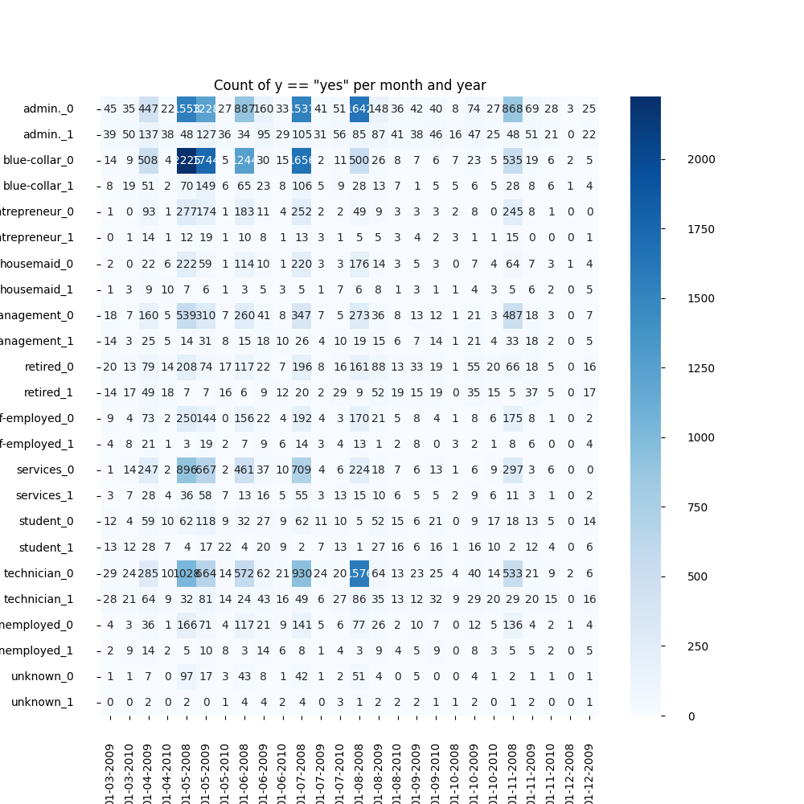
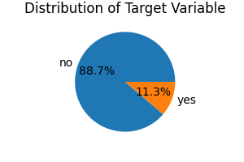
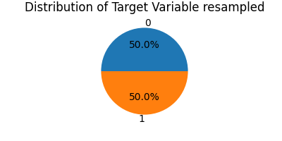
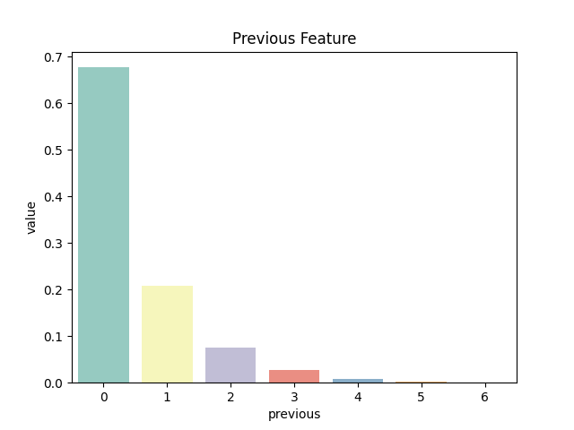
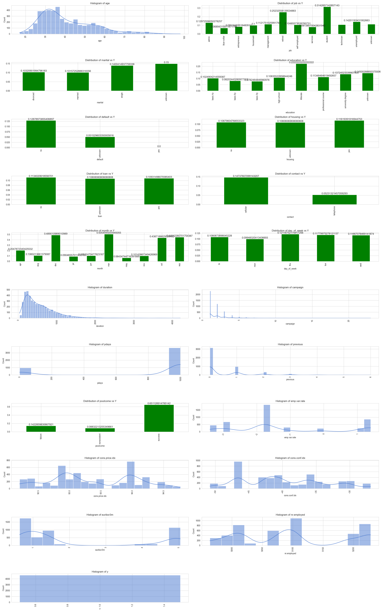
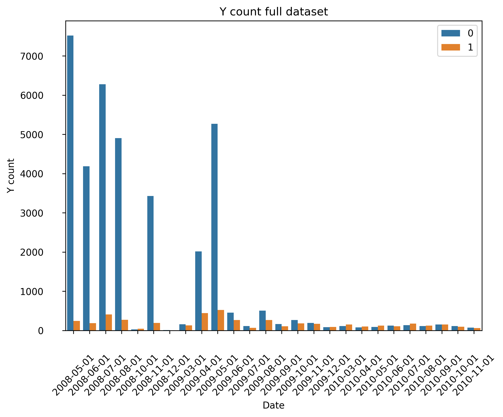
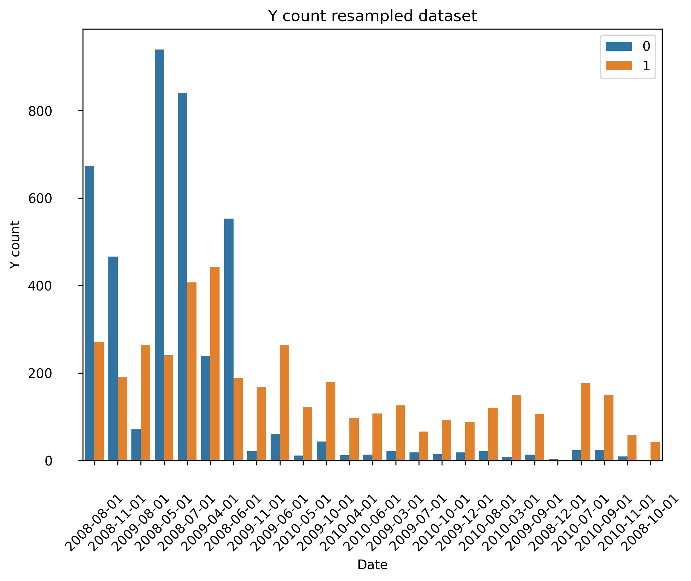
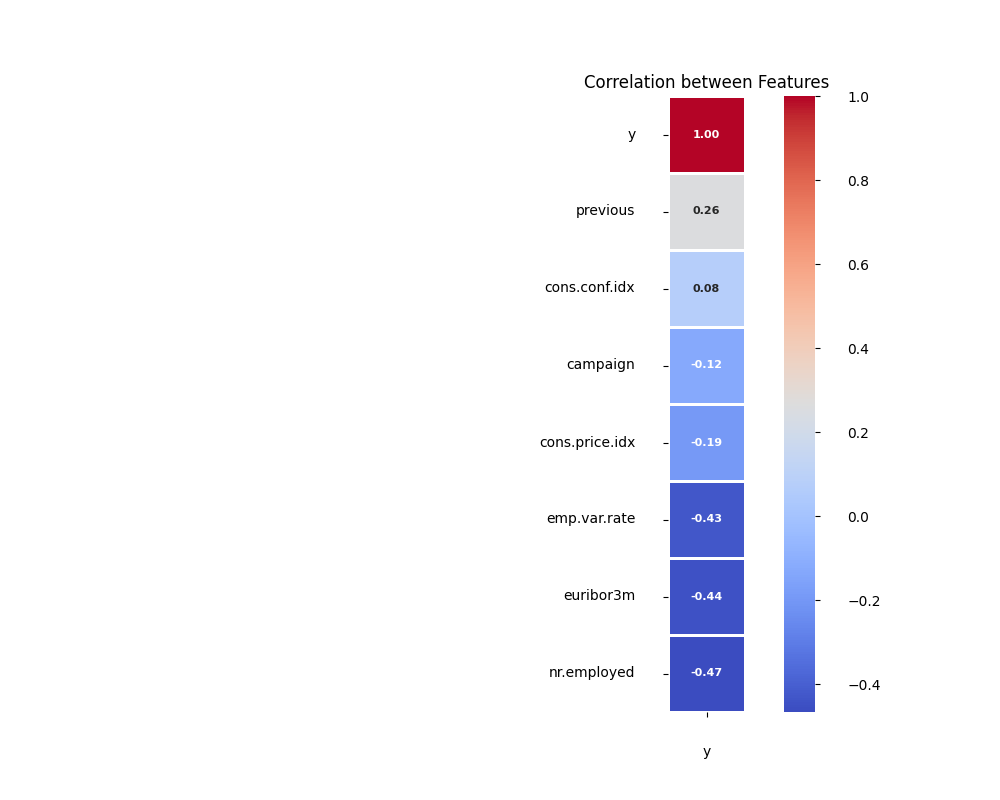

<h1>Table of content</h1>
<ul>
<li><a href="#ClassificationReport">Classification Report</a></li>
<li><a href="#Objective">Objective</a></li>
<li><a href="#DataAssesment">Data Assesment</a></li>
<li><a href="#ModelSelection">Model Selection</a></li>
<li><a href="#ExecutiveSummary">Executive Summary</a></li>
</ul>

<h1>
Classification Report:
</h1>

The following dataset contains information about a Bank Marketing Report

<blockquote>
<h3>Additional Information</h3>

The data is related with direct marketing campaigns (phone calls) of a Portuguese banking institution. The classification goal is to predict if the client will subscribe a term deposit (variable y).

 
<cite>
The data is related with direct marketing campaigns of a Portuguese banking institution. The marketing campaigns were based on phone calls. Often, more than one contact to the same client was required, in order to access if the product (bank term deposit) would be ('yes') or not ('no') subscribed.  
More information can be found in the following <a target="_blank" href="https://archive.ics.uci.edu/dataset/222/bank+marketing">link</a>.
</cite>
</blockquote>

<h1>Objective</h1>

The primary objective is to develop a highly accurate classification model that predicts whether a client will subscribe to a term deposit (variable y), leveraging machine learning algorithms to identify key factors influencing conversion, optimize feature selection, and provide actionable insights, and ultimately increase conversion rates by at least 20%, driving business growth and informing data-driven decision-making.

<h1>Data Assessment Report</h1>

<h2>Initial Data Assessment</h2>

At first glance, the data appears remarkably clean.

<h2>Data Composition</h2>

The dataset comprises 41,188 records. Notably, the report highlights that "often, more than one contact to the same client was required."

<h2>Data Quality</h2>

Our analysis reveals:

<ul>
<li>No missing data</li>
<li>No outliers detected</li>
</ul>

However, several modifications had to be performed to the data, including:

<ul>
<li>

<pre>"11 - duration: last contact duration, in seconds (numeric). Important note: this attribute highly affects the output target (e.g., if duration=0 then y='no').  
Yet, the duration is not known before a call is performed. Also, after the end of the call y is obviously known.  
Thus, this input should only be included for benchmark purposes and should be discarded if the intention is to have a realistic predictive model."</pre>

Action: The feature "duration" was dropped from the dataset.

</li>
<li>
<pre>"bank-additional-full.csv with all examples, ordered by date (from May 2008 to November 2010)."</pre>

Action:

<ul>
<li>A "year" field was added to the dataset.</li>
<li>A "date" field was created with the month and year.</li>
</ul>

Result: The dataset now has dates that go from May 2008 to November 2010 and the month and year features were dropped.

In the following graph, we can see the distribution of the outcome variable per month and year

<article>

Whilst incorporating the date feature helped to sort and visualise the data in chronological order, I encountered a prevalent issue inherent to working with temporal data. Given that the dates are distinct and never replicated, they were likely to cause overfitting and disproportionately influence the model's importance. Consequently, I opted to exclude the date feature from the dataset.

</article>
</li>
</ul>

Class imbalances were addressed by:

<ul>
<li>Age – divided into groups</li>
<li>Job – divided into groups</li>
<li>Campaign – divided into groups</li>
<li>Default – binarized</li>
<li>Loan – binarized</li>
<li>Poutcome – binarized</li>
<li>Pdays – dropped due to highly imbalanced data</li>
</ul>

Correlation analysis led to:

<ul>
<li>euribor3m – dropped because it was highly correlated with emp.var.rate</li>
</ul>

<h2>Conversion Rate Insights</h2>

After conducting an in-depth analysis of the data, we uncovered valuable insights into the output class distribution:

<table style="border-collapse: collapse; width: 50%; border-radius: 10px; overflow: hidden; margin: auto; background-color: white;">
<thead style="background-color: #f0f0f0; border-bottom: 1px solid #ddd;">
</thead>
<tbody>
<tr>
<td>
<table>
<thead>
<tr>
<th>Class</th>
<th>Percentage</th>
</tr>
</thead>
<tbody>
<tr>
<td>Negative class ('no')</td>
<td>88.73%</td>
</tr>
<tr>
<td>Positive class ('yes')</td>
<td>11.27%</td>
</tr>
</tbody>
</table>
</td>
<td>

</td>
</tr>
</tbody>
</table>

Our analysis revealed two key findings:

<ol>
<li><strong>Class Imbalance:</strong> The output class exhibits a significant imbalance, with a substantial majority (88.73%) belonging to the negative class ('no') and a relatively small minority (11.27%) belonging to the positive class ('yes'). This imbalance may impact model performance and necessitates specialized techniques to handle class imbalance.</li>
<li><strong>Low Conversion Rate:</strong> Our analysis also revealed a remarkably low conversion rate. Specifically, only about 1 in 10 calls (11.27%) results in a successful conversion. This highlights the challenge of predicting positive outcomes and underscores the importance of optimizing models to identify key factors influencing conversions.</li>
</ol>

To address this imbalance, we employed the RandomUnderSampler algorithm. This yielded:

<ul>
<li>
Balanced class distribution
</li>
<li>
Improved model performance potential
</li>
</ul>

<h2>Deeper Insights into Conversion Patterns</h2>

Further examination of the dataset's web page revealed an important detail:

<blockquote>"Often, more than one contact to the same client was required"</blockquote>

This insight prompted a deeper investigation into the relationship between the number of previous calls and successful conversions. The distribution of previous calls leading to successful conversions is as follows:

<table style="border-collapse: collapse; width: 70%; border-radius: 10px; overflow: hidden; margin: auto; background-color: white;">
<tbody style="text-align:center;">
<tr>
<td>
<table>
<thead>
<tr>
<th>Previous Calls</th>
<th>Percentage</th>
</tr>
</thead>
<tbody>
<tr>
<td>0</td>
<td>67.69%</td>
</tr>
<tr>
<td>1</td>
<td>20.84%</td>
</tr>
<tr>
<td>2</td>
<td>7.54%</td>
</tr>
<tr>
<td>3</td>
<td>2.76%</td>
</tr>
<tr>
<td>4</td>
<td>0.82%</td>
</tr>
<tr>
<td>5</td>
<td>0.28%</td>
</tr>
<tr>
<td>6</td>
<td>0.06%</td>
</tr>
</tbody>
</table>
</td>
<td>

</td>
</tr>

</tbody>
</table>

These findings indicate that:

<ul>
<li>The majority of successful conversions (67.69%) occur on the first call.</li>
<li>The probability of conversion decreases significantly with each subsequent call.</li>
<li>Only about 1 in 5 customers (20.84%) convert after a second call.</li>
<li>The conversion rate drops to less than 8% after two or more calls.</li>
</ul>

This analysis suggests that:

<ol>
<li><strong>Early engagement is crucial:</strong> The likelihood of conversion is highest during the initial call, emphasizing the importance of effective first interactions.</li>
<li><strong>Diminishing returns:</strong> Each subsequent call yields progressively lower conversion rates, indicating potential fatigue or decreased interest.</li>
<li><strong>Targeted follow-ups:</strong> Understanding the optimal number and timing of follow-up calls can help maximize conversion rates.</li>
</ol>

<h2>Feature Distribution</h2>

The following graphs illustrate the state of each feature:

<h2>Data Preprocessing Approach</h2>

Upon discovering that the dataset spanned from <strong>May 2008 to November 2010</strong>, I initially considered incorporating the date as a feature. However, I soon realised that this would introduce a variable that would never recur, potentially dominating the model and leading to overfitting.

Removing the date resulted in subpar performance, characterised by low scores and poor precision for both classes 0 and 1, with an alarmingly high false negative rate.

An alternative approach involved splitting the data at a point where the classes were more balanced, but this too led to overfitting.

Undeterred, I explored another strategy that ultimately yielded improved results.

Specifically, I utilised a previously employed method to calculate the date, then discarded the month and year components.

Subsequently, I applied RandomUnderSampler to ensure the date was incorporated into the resampling process, thereby maintaining proportional sampling by month and year.

Following resampling, I extracted the month from the previously generated date, effectively reverting to the original monthly format, and removed the date from the dataset.

Although the process may seem complex, the outcomes suggest it has been effective, with notable improvements in test set scores and class precision.

<table style="border-collapse: collapse; width: 25%; border-radius: 10px; overflow: hidden; margin: auto; background-color: white;">
<thead>
<tr>
<th>
Outcome per year Full Dataset
</th>
<th>
Outcome per year Resampled data
</th>
</tr>
</thead>
<tbody>
<tr>
<td>

</td>
<td>

</td>
</tr>
</tbody>
</table>

<h2>Correlation Matrix Analysis</h2>

The correlation matrix reveals valuable insights into the relationships between features and the target variable.

After running the correlation matrix, we obtained the following results:

<table style="border-collapse: collapse; width: 25%; border-radius: 10px; overflow: hidden; margin: auto; background-color: white;">
<thead style="background-color: #f0f0f0; border-bottom: 1px solid #ddd;">
<tr>
<th>Data</th>
<th>Heatmap</th>
</tr>
</thead>
<tbody style="text-align:center;">
<tr>
<td style="text-align:center;">

<table>
<thead>
<tr>
<th>Feature</th>
<th>Correlation Coefficient</th>
</tr>
</thead>
<tbody>
<tr>
<td>y</td>
<td>1.000000</td>
</tr>
<tr>
<td>previous</td>
<td>0.257287</td>
</tr>
<tr>
<td>cons.conf.idx</td>
<td>0.076100</td>
</tr>
<tr>
<td>campaign</td>
<td>-0.123614</td>
</tr>
<tr>
<td>cons.price.idx</td>
<td>-0.193544</td>
</tr>
<tr>
<td>emp.var.rate</td>
<td>-0.427680</td>
</tr>
<tr>
<td>euribor3m</td>
<td>-0.444488</td>
</tr>
<tr>
<td>nr.employed</td>
<td>-0.465513</td>
</tr>
</tbody>
</table>

</td>
<td>

</td>
</tr>
</tbody>
</table>

<h2>Model Selection</h2>

This section presents a comparative analysis of four machine learning models to predict term deposit subscriptions using features selected through Recursive Feature Elimination (RFE).

<h3>Methodology</h3>

The study employed a rigorous evaluation framework to assess the performance of the following models:

<ul>
<li>Support Vector Classification (SVC)</li>
<li>Decision Trees (DT)</li>
<li>K-Nearest Neighbours (KNN)</li>
<li>Logistic Regression (LGR)</li>
</ul>

<h3>Evaluation Criteria</h3>

Model performance was evaluated based on:

<ul>
<li>Accuracy</li>
<li>Precision</li>
<li>Recall</li>
<li>F1-score</li>
<li>Computational efficiency</li>
</ul>

<h3>Recursive Feature Elimination (RFE)</h3>

RFE was utilized to optimize model performance by identifying the most relevant features contributing to predictive accuracy. This approach offered several benefits:

<ul>
<li>Informed feature selection</li>
<li>Enhanced model performance</li>
<li>Determination of feature importance</li>
</ul>

By leveraging RFE, this analysis aimed to identify the optimal combination of features and models to accurately predict term deposit subscriptions.

Results of the model evaluation are presented in the subsequent section.

<h3>
Model Comparison Table
</h3>

<table style="border-collapse: collapse; width: 50%; border-radius: 10px; overflow: hidden; margin: auto; background-color: white;">
<thead style="background-color: #f0f0f0; border-bottom: 1px solid #ddd;">
<tr>
<th></th>
<th>Accuracy</th>
<th>Train Accuracy</th>
<th>Elapsed Time (s)</th>
</tr>
</thead>
<tbody>
<tr>
<th>SVM</th>
<td>0.762348</td>
<td>0.766056</td>
<td>140.06577</td>
</tr>
<tr>
<th>KNN</th>
<td>0.760729</td>
<td>0.761717</td>
<td>13.911737</td>
</tr>
<tr>
<th>DT</th>
<td>0.761943</td>
<td>0.767964</td>
<td>122.357201</td>
</tr>
<tr>
<th>LGR</th>
<td>0.758704</td>
<td>0.760155</td>
<td>1.974897</td>
</tr>
</tbody>
</table>

<h2>Best Model: SVM (Support Vector Machine)</h2>

Accuracy: 0.762348

<h2>Why SVM is the Best Model</h2>
<ul>
<li><strong>Highest Accuracy</strong>: SVM has the highest accuracy among all models.</li>
<li><strong>Best Precision and Recall Balance</strong>: SVM achieves a good balance between precision and recall for both classes.</li>
<li><strong>Highest F1-score for Class 0</strong>: SVM has the highest F1-score for Class 0, indicating better performance on this class.</li>
</ul>

<h2>Comparison with Other Models</h2>
<table>
<tr>
<th>Model</th>
<th>Accuracy</th>
<th>F1-score</th>
<th>Notes</th>
</tr>
<tr>
<td>Logistic Regression (LGR)</td>
<td>Slightly lower</td>
<td>Slightly lower</td>
<td>Comparable performance to DT</td>
</tr>
<tr>
<td>Decision Tree (DT)</td>
<td>Similar to LGR</td>
<td>Higher variance</td>
<td>Less stable performance</td>
</tr>
<tr>
<td>K-Nearest Neighbors (KNN)</td>
<td>Slightly lower</td>
<td>Slightly lower</td>
<td>Less accurate than SVM</td>
</tr>
</table>

<h2>Considerations</h2>
<ul>
<li><strong>Computational Cost</strong>: SVM is the most computationally expensive model, taking 140 seconds to train.</li>
<li><strong>Hyperparameter Tuning</strong>: SVM's performance is highly dependent on hyperparameter tuning, which can be time-consuming.</li>
</ul>

<h3>Insights from Feature Selection and Coefficients</h3>

<h4>Top Positive Contributors:</h4>
<ul>
<li>poutcome_success (0.970536): Successful previous outcomes significantly increase the likelihood of a positive response.</li>
<li>cons.price.idx (0.343064): Higher consumer price indices are associated with increased positive responses.</li>
<li>contact_cellular (0.280276): Contact via cellular phone is more effective than other methods.</li>
</ul>

<h4>Top Negative Contributors:</h4>
<ul>
<li>poutcome_failure (-0.787409): Failed previous outcomes strongly decrease the likelihood of a positive response.</li>
<li>emp.var.rate (-0.618480): Higher employment variation rates are associated with decreased positive responses.</li>
<li>euribor3m (-0.599089): Higher 3-month Euribor rates decrease the likelihood of positive responses.</li>
</ul>

<h4>Demographic Insights:</h4>
<ul>
<li>
Age:
<ul>
<li>Both younger individuals (17-24) and older individuals (55-110) are more likely to respond positively.</li>
<li>Middle-aged individuals (25-34, 35-44, 45-54) have a negative effect on the response, with decreasing coefficients as age increases.</li>
</ul>
</li>
<li>
Education:
<ul>
<li>University-educated individuals are more likely to respond positively.</li>
<li>Those with basic education (4y, 9y) are less likely to respond positively.</li>
</ul>
</li>
<li>
Marital Status:
<ul>
<li>Married individuals are less likely to respond positively.</li>
<li>Single individuals are more likely to respond positively.</li>
</ul>
</li>
</ul>

<h4>Contact and Timing Insights:</h4>
<ul>
<li>
Contact Method:
<ul>
<li>Cellular phone contact is more effective than telephone contact.</li>
</ul>
</li>
<li>
Day of Week:
<ul>
<li>Wednesday is the most effective day for contact.</li>
<li>Monday is the least effective day.</li>
</ul>
</li>
</ul>

<h4>Other Insights:</h4>
<ul>
<li>Loan status: Having a loan decreases the likelihood of a positive response.</li>
<li>Housing status: Having housing increases the likelihood of a positive response.</li>
</ul>

These insights can help refine marketing strategies, targeting, and timing to improve response rates.

<h1>Executive Summary: Enhancing Term Deposit Sales Effectiveness</h1>

<h2>Background</h2>

This study examines data from direct marketing campaigns conducted by a Portuguese banking institution, aiming to identify optimal strategies for improving sales conversion rates for term deposits. The banking sector faces increasing competition and evolving customer expectations, making it essential to optimize sales strategies and inform data-driven decision-making.

<h2>Objective</h2>

The primary objective of this analysis is to identify strategic improvements to increase conversion rates for term deposit sales through direct marketing campaigns, ultimately driving business growth and improving customer satisfaction.

<h2>Data Understanding</h2>

Analysis of the dataset revealed:

<ul>
<li>Conversion Rate: 11.3%, indicating significant room for improvement. This implies that out of 10 calls, only one results in a sale.</li>
<li>Contact Frequency: Often, more than one contact with the same client is required to secure a conversion.</li>
<li>
Further analysis of the conversion patterns revealed:
<ul>
<li>The majority of successful conversions occur on the first call (67.69%).</li>
<li>Subsequent calls yield significantly lower conversion rates, with only 20.84% of customers converting after a second call.</li>
<li>Notably, the conversion rate drops to less than 8% after two or more calls.</li>
</ul>
</li>
</ul>

<h2>Model Evaluation Results</h2>

After evaluating machine learning models, the Support Vector Machine (SVM) model emerged as the best performer:

<ul>
<li>Accuracy: 0.762348</li>
<li>Train Accuracy: 0.766056</li>
<li>Elapsed Time: 140.06577 seconds</li>
</ul>

<h2>Reasons for Selecting the SVM Model</h2>

The SVM model was chosen due to:

<ul>
<li>Highest accuracy among evaluated models</li>
<li>Best balance between precision and recall for both classes</li>
<li>Highest F1-score for initial call conversions</li>
</ul>

<h2>Key Insights</h2>

Analysis revealed key factors influencing term deposit conversion:

<ul>
<li>Successful previous outcomes (cat__poutcome_success)</li>
<li>Higher consumer price indices (num__cons.price.idx)</li>
<li>Contact via cellular phone (cat__contact_cellular)</li>
<li>Demographics: younger and older individuals, university-educated, and single individuals</li>
<li>Economic indicators: employment variation rate, consumer confidence index</li>
</ul>

<h2>Strategic Recommendations:</h2>

<ul>
<li>Optimize Initial Contact Strategies: Focus on high-potential customers and refine marketing messaging.</li>
<li>Implement Targeted Marketing Campaigns: Utilize campaign metrics, economic indicators, and previous outcomes to create targeted campaigns.</li>
<li>Enhance Sales Force Efficiency: Continuously monitor conversion rates and adjust sales strategies accordingly.</li>
<li>Leverage Data-Driven Insights: Use predictive modeling to prioritize high-potential prospects.</li>
</ul>

<h2>Expected Business Impact:</h2>

<ul>
<li>Increase conversion rates by 4-10 percentage points.</li>
<li>Enhance sales efficiency through targeted efforts, reducing unnecessary follow-up calls.</li>
<li>Improve customer satisfaction through personalized interactions and tailored marketing campaigns.</li>
<li>Drive business growth through data-driven decision-making, optimizing resource allocation.</li>
</ul>

<h2>Conclusion</h2>

This analysis highlights critical factors influencing term deposit conversion rates and provides actionable recommendations. By optimizing marketing strategies using SVM model insights, businesses can:

<ul>
<li>Increase conversion rates by 4-10 percentage points</li>
<li>Enhance sales efficiency through targeted efforts</li>
<li>Improve customer satisfaction through personalized interactions</li>
<li>Drive business growth through data-driven decision-making</li>
</ul>

Implementing these strategies will drive business growth, enhance customer satisfaction, and establish a data-driven approach to sales optimization.

